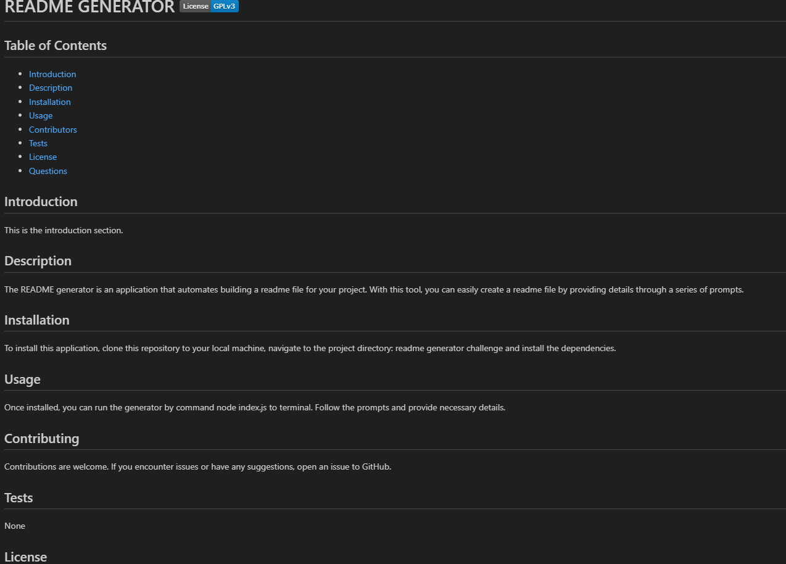
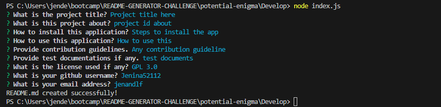

# README GENERATOR    

## Table of Contents
- [Description](#description)
- [Installation](#installation)
- [Usage](#usage)
- [Contributors](#contributing)
- [Tests](#tests)
- [License](#license)
- [Questions](#questions)

## Description
The README generator is an application that automates building a readme file for your project. With this tool, you can easily create a readme file by providing details through a series of prompts.

## Installation
To install this application, clone this repository to your local machine, navigate to the project directory: readme generator challenge and install the dependencies.

## Usage
Once installed, you can run the generator by command node index.js to terminal. Follow the prompts and provide necessary details. 

## Contributing
Contributions are welcome. If you encounter issues or have any suggestions, open an issue to GitHub.

## Tests
None

## License 
    This application is covered under license GPL 3.0.
    For more information about the license, visit: https://www.gnu.org/licenses/gpl-3.0 or click the badge on top.

## Questions
  My GitHub profile is: Jenina52112 [View on GitHub](https://github.com/Jenina52112)

  For additional questions, contact me at email address: jeninadelacruz521@yahoo.com

